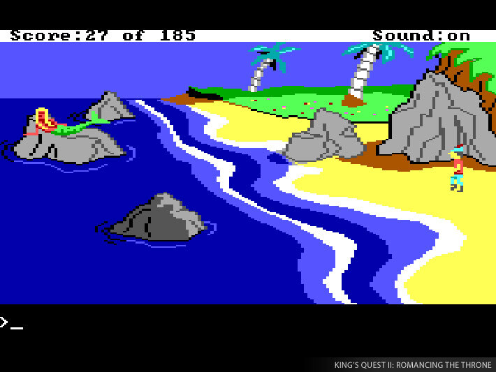
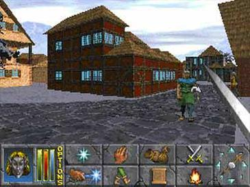
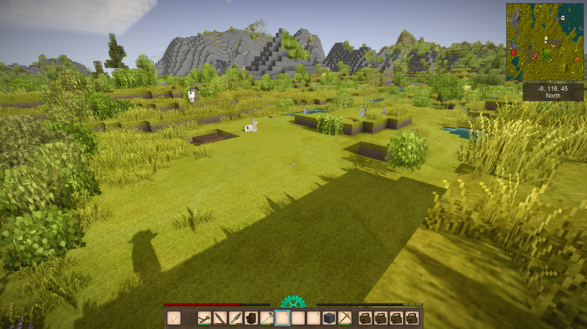

<!--

This presentation is intended to use Marp https://marp.app/ and specifically the VSCode Marp extension to render its contents.

-->

<!-- paginate: skip -->

# Snowfall

## An open source, open-world, voxel-based adventure and exploration game where sharing even small contributions is easy and enjoyable

---

# Tone

Combine the fun, whimsical mix of fairy tale, legend, and mythology akin to the original **King's Quest** series with the the promise of an infinite world of real characters, cities, politics, and guilds promised by the classic role-playing game **Daggerfall**.

---

# Gameplay

#### **Exploration** is where to start

Snowfall is an **exploration** game where the player is rewarded for discovering new characters, locations, history, and making connections in the world.

#### **Contribution** is how to stay engaged

Models, characters, locations, everything is intended to be editable and exportable from within the game. Creating a "mod" is as easy as curating and tweaking a collection of in-game experiences. The "official" distribution lives alongside a set of quality-assured forked distributions and personal mods that are easy to use & share.

---

# Voxel Engine Visuals

The game engine voxel-based and aiming for a level of visual fidelity and performance such as:

-   [Vintage Story](https://www.vintagestory.at/)
-   [Teardown](https://teardowngame.com/)
-   [Lay of the Land](https://store.steampowered.com/app/2776090/Lay_of_the_Land/)

> Note: the above regards visual fidelity, not gameplay!

---

# Story
